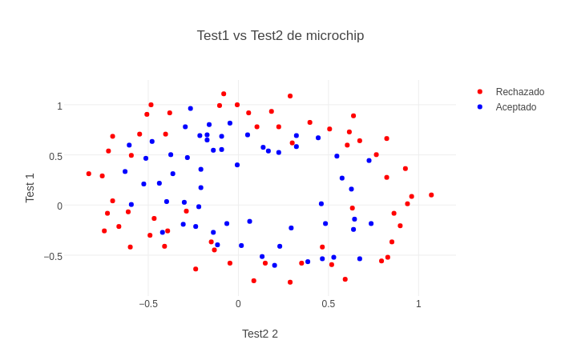

# Reto Examenes para Admisión
## Descripción
Este dataset es un ejercicio del curso de [Machine Learning de Andrew Ng](https://www.coursera.org/learn/machine-learning/home/welcome). Consiste en un conjuto de datos de 2 variables:
* Resultado de test 1 a un microchip
* Resultado de test 2 a un microchip
* Resultado si fue el chip fue aceptado



El dataset consiste en 118 datos.


### Ranking
Ver [ranking](https://github.com/charlielito/supervised-basico-microchip-tests/blob/master/ranking.md).

### Formato Datos
Los datos se encuentran en los siguientes archivos CSV:
* `traning-set.csv`
* `test-set.csv`

### Variables
* Features: Las primeras 2 columnas del csv son los resultados del test 1 y test 2 correspondientemente.
* Labels: La última columna indica la clase (si fue o no rechazado 1 o 0).


### Objetivo
Crear un algortimo que tome como input un los resultados de los tests y retorne si el microchip fue aceptado o no. Solo se pueden utilizar los datos del `traning-set.csv` para entrenar.

El performance se debe medir con respecto a los datos del `test-set.csv` utilizando la siguiente formula
```python
score = n_aciertos / n_total * 100
```
donde `n_aciertos` es el numero de imagenes clasificadas de forma correcta y `n_total` es el numero total de muestras en el `test-set`.


### Notas Teoricas
* [SVM](https://en.wikipedia.org/wiki/Support_vector_machine)
* [Decision Trees](https://en.wikipedia.org/wiki/Decision_tree_learning)
* [Regresión logística](https://en.wikipedia.org/wiki/Logistic_regression)

### Solucion
Ver procedimiento de [solucion](https://github.com/colomb-ia/formato-retos#solucion).

##### Requerimientos
*Indica los requerimientos para utilizar el codigo de tu solucion.*

##### Procedimiento
*Indica el procedimiento que se debe seguir para reproducir tu solucion.*

##### Metodo
*Indica el metodo que utilizaste para solucionar el reto.*

##### Resultados
*Indica el metodo que utilizaste para solucionar el reto.*

## Getting Started
Para resolver este reto primero has un [fork](https://help.github.com/articles/fork-a-repo/) de este repositorio y [clona](https://help.github.com/articles/cloning-a-repository/) el fork en tu maquina.

```bash
git clone https://github.com/{username}/supervised-basico-microchip-tests
cd supervised-basico-microchip-tests
```

*Nota: reemplaza `{username}` con tu nombre de usuario de Github.*

### Requerimientos
Para descargar y visualizar los datos necesitas Python 2 o 3. Las dependencias las puedes encontrar en el archivo `requirements.txt`. Puedes instalarlas fácilmente utilizando el commando

```bash
pip install -r requirements.txt
```
Dependiendo de tu entorno puede que necesites instalar paquetes del sistema adicionales, si tienes problemas revisa la documentación de estas librerías.

# Starter Code Python
Para iniciar con este reto puedes correr el codigo de Python en Jupyter del archivo `python-sample.ipynb`. Este código que ayudará a cargar y visualizar algunas imágenes. Las dependencias son las mismas que se instalaron durante la descarga de los datos, ver [Requerimientos](#requerimientos).

Para iniciar el código solo hay que prender Jupyter en esta carpeta

```bash
jupyter notebook --NotebookApp.iopub_data_rate_limit=1.0e10
```
y abrir el archivo `python-sample.ipynb`.
